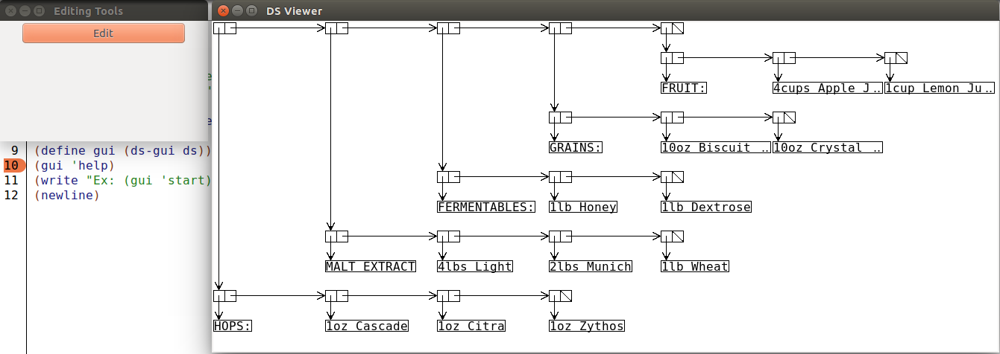
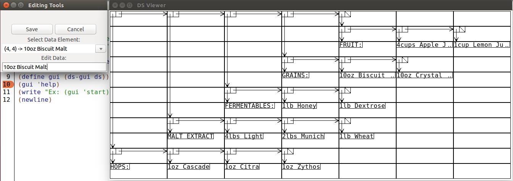

# Data Structure GUI

##Authors
Josh Smolinski

##Overview
The Data Structure GUI (or DS-GUI) is a tool which allows users to see and manipulate data in list-based data structures in scheme. DS-GUI will display a representation of most data structures composed of numbers and strings built using the list keyword.

##Screenshot




##Concepts Demonstrated
* **Data abstraction** is used to store and access the underlying table representing the data structure the user provides.
* DS-GUI is **built in stages** from several layers of **smaller, simpler components**
* **Higher-order procedures** are the backbone of DS-GUI's interaction with various data elements.

##External Technology and Libraries
DS-GUI relies on two external libraries to provide data visualization and editing. The first is the Racket GUI Toolkit which provides the framework for the editor itself. The second is the Racket Drawing Toolkit which provides the ability to draw the diagrams before and after the user edits them.

##Favorite Lines of Code
This procedure is the heart of the data viewer. It takes the internal table of the elements and converts it to a bitmap composed of smaller diagram components. It is my favorite procedure because it is why I started the project; I wanted to make data visible and it does just that. This procedure demonstrates the idea of building something big from smaller components. It also embodies abstraction; the user has no idea this table exists, they only know of the bitmap they see. 
```scheme
;Iterate through the table and draw each element
(define (draw-table-elements table current-entry dc)
  (define this-entry (table-entry current-entry table))
  (cond ((null? table) null)
        ((pair? table) 
           (if (null? this-entry)
               null
               (begin
                 (cond ((eqv? (element-type this-entry) 'data)
                        (draw-data
                         dc
                         (element-value this-entry)
                         (element-row this-entry)
                         (element-col this-entry)))
                       (else
                        (if (or 
                             (and (not (null? (element-car this-entry)))
                                  (> (- (car (element-car this-entry)) (element-row this-entry)) 1))
                             (and (not (null? (element-cdr this-entry)))
                                  (> (- (cadr (element-cdr this-entry)) (element-col this-entry)) 1)))
                            (draw-spaced-node this-entry dc)
                            (draw-node
                             dc
                             (type-to-path (element-type this-entry))
                             (element-row this-entry)
                             (element-col this-entry)))))
                 (draw-table-elements table (+ current-entry 1) dc))))))
```

##Additional Remarks
The tool was created to allow beginning Scheme programmers to see how their data was being managed behind the scenes without having to draw out the diagram by hand. With the visual representation provided by the tool, it is easier for the user to see how they would access any given element.

That being said, the Data Structure GUI is really a functional prototype. As a prototype it has a number of limitations. It does not support very complicated structures. All nodes in the structure must either point to another node, data, or null. No node can point to more than one data element.

## Documentation
The latest release of the Data Structure GUI can be found here

To use the DS-GUI in its current state:
1. Open Sandbox.rkt
2. Change "ds" to your data structure
3. Click Run in Racket
4. Use (gui 'start) in the Racket Run window to launch the application
5. Click edit to enter editing mode
6. Select a data element from the drop-down menu
7. Edit the data
8. Save or Cancel
9. To save your changes, enter (gui 'save) in the Racket Run window

For complete documentation, please see the documentation file in the documentation folder.
