# Data Structure GUI Documentation
## Creating an instance of DS-GUI
* (define gui (ds-gui your-ds))
* NOTE: At this time, "cons" elements are not supported, all structures must be lists or lists of multiple lists

## Using DS GUI
### Using a user-defined data structure
Open Sandbox.rkt

Edit "ds"

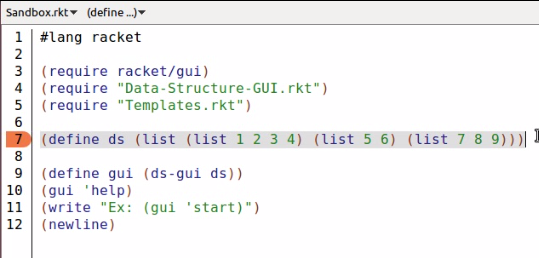

Note the name of the DS-GUI instance

Click "Run" in Racket

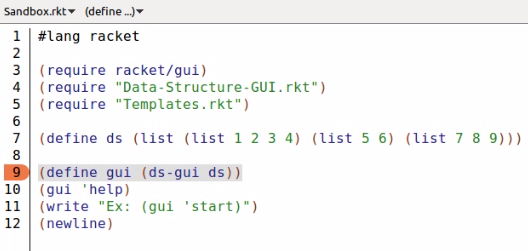

Start DS-GUI

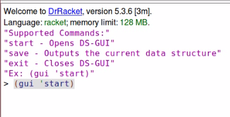

View the data structure

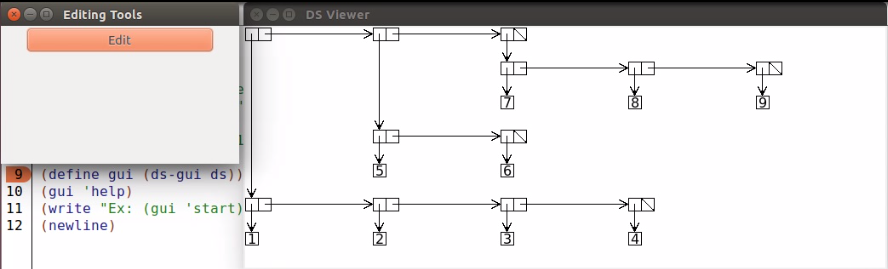

Click edit to go into editing mode

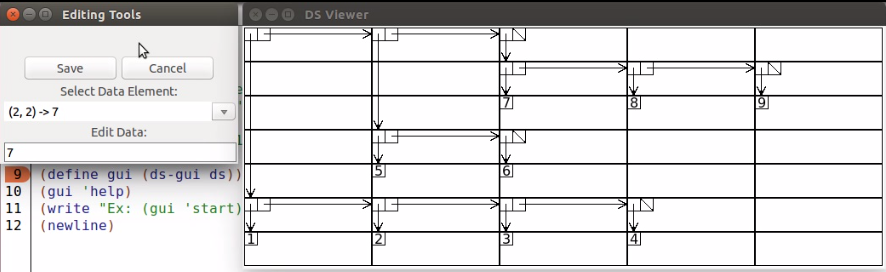

Select a data element

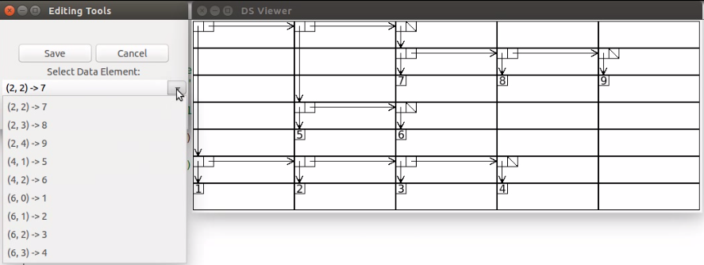

Edit the data

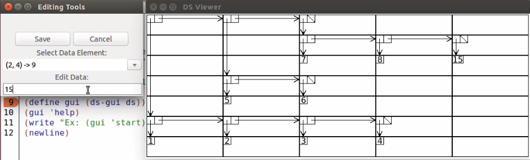

Click "Save"

Save the changes to a variable

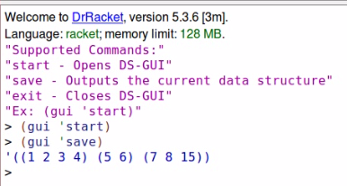

### Using a template data structure
Open Sandbox.rkt

Edit "ds" to point to a template from Templates.rkt

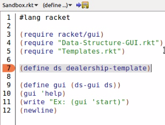

Note the name of the DS-GUI instance

Click "Run" in Racket

Start DS-GUI

View the data structure

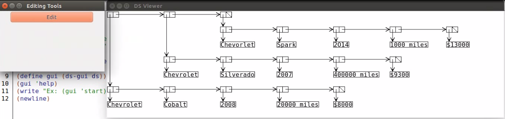

Click edit to go into editing mode

Select a data element

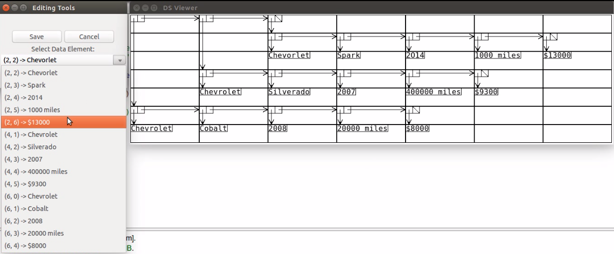

Edit the data

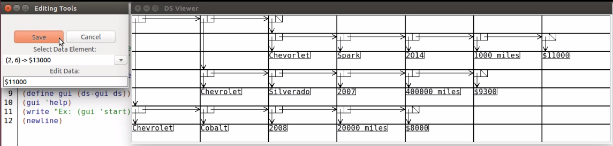

Click "Save"

Save the changes to a variable

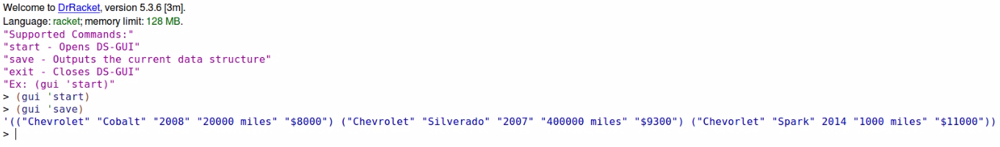

### Issuing commands:
* (gui 'command)

### Supported Commands:
* 'start -> Opens DS-GUI
* 'exit -> Closes DS-GUI
* 'save -> Returns the current data structure being shown

## Development Information:
### GUI Core:
The Data Structure GUI is built on the Data-Structure-GUI-core which maintains the various data structures and procedures to manipulate them. The GUI core accepts the following commands from the GUI:
* 'draw -> Draws the data structure
* 'draw-enclosed -> Draws the data structure with the row, column grid
* 'load -> Used internally to load the master-ds and master-table
* 'peek-ds -> Gets the current master-ds
* 'peek-table -> Gets the current master-table
* 'peek-target -> Gets the current master-target
* 'replace-data -> Replaces an element in the editing-table
* 'save -> Save the table (usually after editing)

These are the functions used by the GUI Core:
* (build-table table) -> Table-Construction.rkt
* (build-list table) -> Table-Deconstruction.rkt
* (make-target table) -> Diagram-Drawing.rkt
* (make-dc table) -> Diagram-Drawing.rkt
* (draw-table table) -> Diagram-Drawing.rkt
* (draw-enclosed-table table) -> Diagram-Drawing.rkt

### File Descriptions:
* Data-Structure-GUI.rkt - The main GUI
* Data-Structure-GUI-Core.rkt - Contains the structures and procedures to manipulate them
* Diagram-Components.rkt - Contains the diagram images used to draw a structure
* Diagram-Drawing.rkt - Contains the drawing procedures for a given table
* Sandbox.rkt - Currently a sandbox for interacting with the Data-Structure-GUI
* Table-Construction.rkt - Contains the table building procedure for a given data structure
* Table-Core-Utils.rkt - Contains counting procedures, table manipulation procedures, and accessors
* Table-Deconstruction.rkt - Contains the list building procedure for a given table
* Table-Editing.rkt - Contains the element replacement procedure
* Table-Sorting.rkt - Contains the sorting procedures for a given table
* Templates.rkt - Contains a few sample data structures for use in the sandbox

### File Hierarchy:
Top-Level:
* Data-Structure-GUI.rkt
* Data-Structure-GUI-Core.rkt

Mid-Level:
* Diagram-Drawing.rkt
* Table-Construction.rkt
* Table-Deconstruction.rkt
* Table-Editing.rkt

Base:
* Diagram-Components.rkt
* Table-Core-Utils.rkt
* Table-Sorting.rkt

Accessory:
Sandbox.rkt
Templates.rkt

